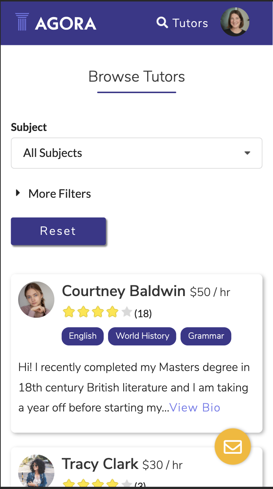
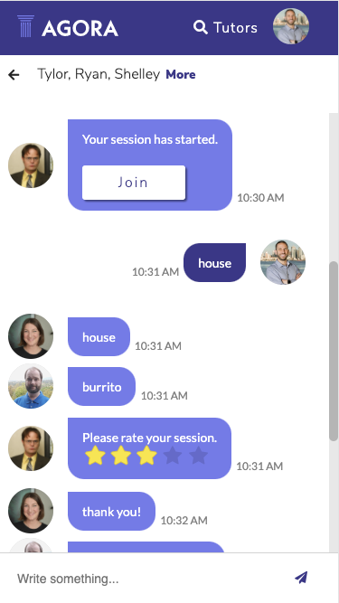
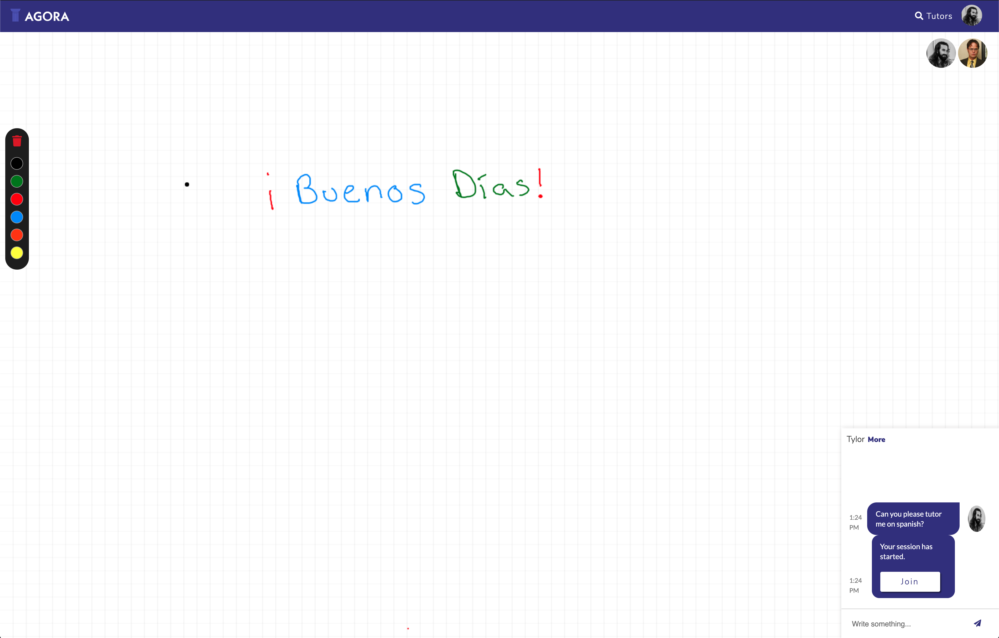

# AGORA

[GitHub](https://github.com/agora/agora-tutor)

[Deployed Link](https://agora-tutor.herokuapp.com/)

## Table of Contents

- [Description](#description)
- [Visuals](#visuals)
- [Usage](#usage)
- [Installation](#installation)
- [Support](#support)

## Description

- An app that solves the challenge of remote learning by connecting tutors and students with ease. The app bridges the gap between qualified tutors hoping to earn extra income and students struggling to stay on track academically. Students and tutors can have live, one-on-one, or group sessions from anywhere in the world, all on our app.

## Visuals

- Demonstrations of the application

  

## Usage

- Sign up as a tutor or student on the hosted site and start exploring!

## Installation

- No installation necessary. The app runs in the browser and can be found at https://agora-tutor.herokuapp.com

## Support

- tylor.kolbeck@gmail.com

- 323seeshell@gmail.com

- harris.ucla@gmail.com

- johntkaplanis@gmail.com
